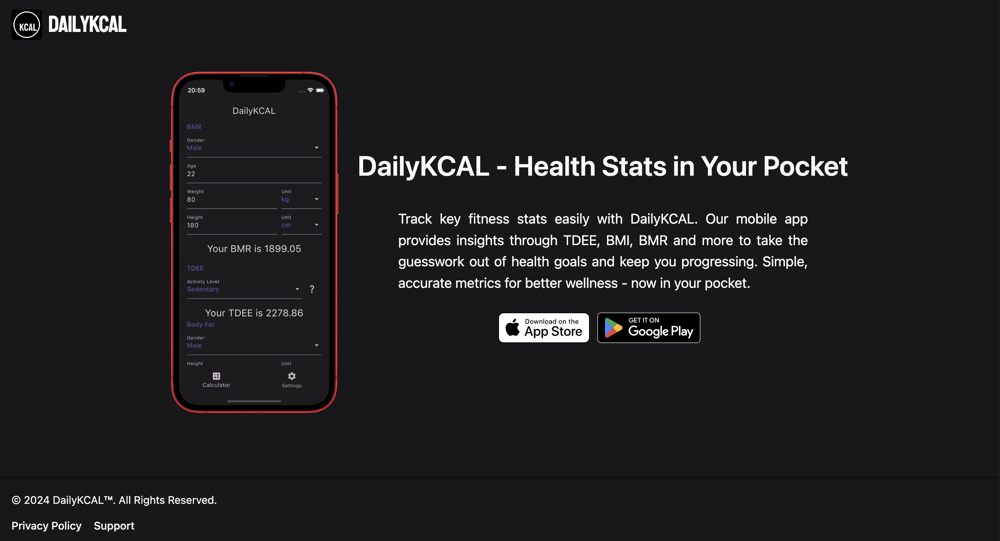
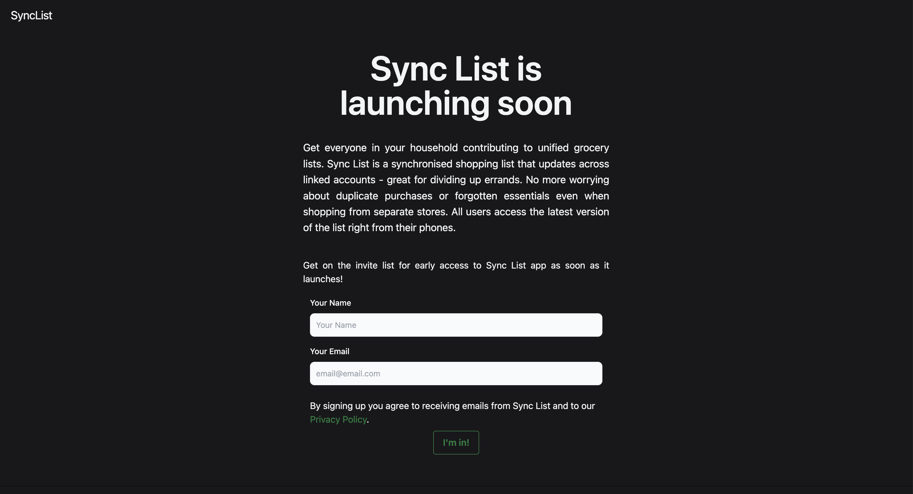
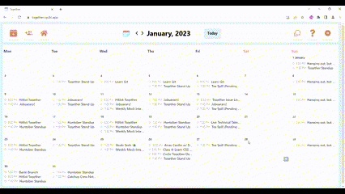

<h3 align="center">Connect with me:</h3>

<h1 align="center">Projects</h1>
<table bordercolor="#66b2b2">
    <tr>
      <td width="50%" valign="top">
      <h3 align="center">DailyKCAL - Website</h3>
         
      
         
        

          
  
      

        
<strong>DailyKCAL - Website </strong> - Landing page website made for app developer.

    </td>
   
<td width="50%" valign="top">
  <h3 align="center">Sync List</h3>
   
  
   
  

  
  
<strong>Sync List</strong> - Pre-launch website made for app developer.

</td>

  </tr>
  <tr>
    <td width="50%" valign="top">
      <h3 align="center">Subreddit Guesser</h3>
         
        
         
        

          
    
  
      

        
<strong>Sveltekit, Python Reddit Api Wrapper (PRAW) & GitHub Actions</strong> - Browser game with daily challenge to guess what subreddit an image was posted in. Updates at midnight daily using GitHub Actions.

    </td>
    <td width="50%" valign="top">
      <h3 align="center">Together</h3>
         
      
         
        

          
  
  
      

        
<strong>MERN Stack</strong> - Open Source contribution to calendar app supporting event scheduling for a community 40,000 strong.

    </td>
  </tr>
  
  <tr>
      <td width="50%" valign="top">
      <h3 align="center">Llama Game</h3>
         
      
         
        

          
  
      

        
<strong>PICO-8 (Lua)</strong> - Llama game made in PICO-8, current work in progress.

    </td>
   
<td width="50%" valign="top">
  <h3 align="center">Space Raiders</h3>
   
  
   
  

  
  
<strong>PICO-8 (Lua)</strong> - Space raiders game made in Pico8/Lua-based environment.

</td>

  </tr>

</table>

<h3 align="center">Languages and Tools:</h3>

                  

<!-- 
 
 
   
   
   
   
    
   
   
   
   
   
   
   
   
   
   
  

 -->

  

